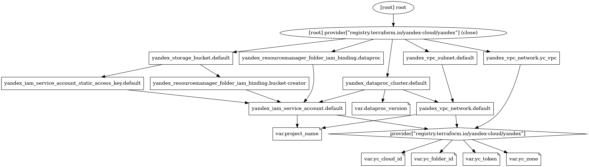

# Terraform DataProc for Yandex Cloud

Terraform for [Yandex Data Proc ](https://cloud.yandex.ru/docs/data-proc/) managed cluster.


## Features

- [v2](https://cloud.yandex.ru/docs/data-proc/release-notes/images#2.0) by default
- 3 [roles](https://cloud.yandex.ru/docs/managed-elasticsearch/concepts/hosts-roles): 
  * `MASTERNODE`
  * `COMPUTENODE`
  * `DATANODE`
- [environments](https://cloud.yandex.ru/docs/data-proc/concepts/environment):
  * HDFS
  * YARN
  * SPARK
  * TEZ
  * MAPREDUCE
  * HIVE

## Backends

There is only [local backend](https://www.terraform.io/language/settings/backends/local).
You [may](https://cloud.yandex.com/en-ru/docs/tutorials/infrastructure-management/terraform-state-storage) use [Yandex Object Storage](https://cloud.yandex.com/en-ru/docs/storage) as a no-locking backend.

## Resource Graph



## Installation

```bash
  terraform init
```
    
## Deployment

To deploy this project run

```bash
  terraform verify && \
  terraform plan && \
  terraform apply
```

## Related

Examples of cloud-agnostic infrastructure as code tools include Yandex Cloud, Terraform and Ansible: [patsevanton/infrastructure-as-a-code-example](https://github.com/patsevanton/infrastructure-as-a-code-example) by [@patsevanton](https://github.com/patsevanton)

## Contributing

Contributions are always welcome!
